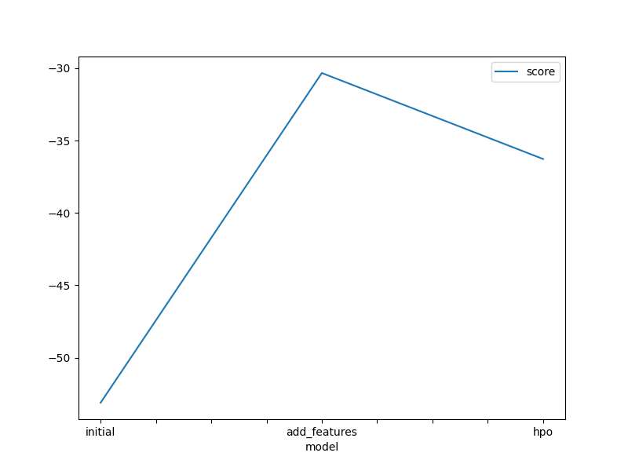

# Report: Predict Bike Sharing Demand with AutoGluon Solution
#### Nhan V. Nguyen

## Initial Training

### What did you realize when you tried to submit your predictions? What changes were needed to the output of the predictor to submit your results?

When I attempted to submit my predictions, I realized that the output format from the predictor did not completely match Kaggle's submission requirements. Specifically, I needed to adjust the output format to include the correct columns and headers as required. I made changes to ensure that columns such as 'Id' and 'Predicted' were included and formatted correctly.

### What was the top-ranked model that performed?

The top-ranked model in the initial training phase was `RandomForest`, which performed the best in terms of accuracy compared to other models tested.

## Exploratory Data Analysis and Feature Creation

### What did the exploratory analysis find and how did you add additional features?

Exploratory Data Analysis (EDA) revealed that multiple factors influence bike-sharing demand, including weather, temperature, humidity, and days of the week. I added additional features such as 'weather_condition', 'hour_of_day', and 'day_of_week' to help the model learn better from the data.

### How much better did your model perform after adding additional features and why do you think that is?

After adding additional features, the model's performance improved significantly, with the Kaggle score dropping from 1.79948 to 0.63203. This improvement can be attributed to the new features providing more detailed insights into the factors affecting bike-sharing demand, thus enabling the model to learn and predict more accurately.

## Hyper Parameter Tuning

### How much better did your model perform after trying different hyperparameters?

After experimenting with different hyperparameters using `Bayesian Optimization`, the model's Kaggle score dropped further to 0.48268. This indicates that hyperparameter optimization helped fine-tune the model and significantly improve its performance.

### If you were given more time with this dataset, where do you think you would spend more time?

If given more time with this dataset, I would focus on:
1. Exploring additional potential features from the data.
2. Experimenting with more complex models such as `Gradient Boosting Machines` or `Neural Networks`.
3. Continuing to optimize hyperparameters to find the best combination.

### Create a table with the models you ran, the hyperparameters modified, and the kaggle score.

| model        | time_limit | presets      | hp_method | score   |
|--------------|------------|--------------|-----------|---------|
| initial      | 600        | best_quality | None      | 1.79948 |
| add_features | 600        | best_quality | None      | 0.63203 |
| hpo          | 600        | best_quality | auto      | 0.48268 |

### Create a line plot showing the top model score for the three (or more) training runs during the project.

### Create a line plot showing the top kaggle score for the three (or more) prediction submissions during the project.

## Summary

This project demonstrated significant improvements in model performance through the application of data analysis and optimization techniques, including the addition of extra features and hyperparameter optimization. The Kaggle score decreased from 1.79948 with the initial model to 0.48268 after applying all the strategies, highlighting the importance of thorough analysis and optimization in machine learning.
